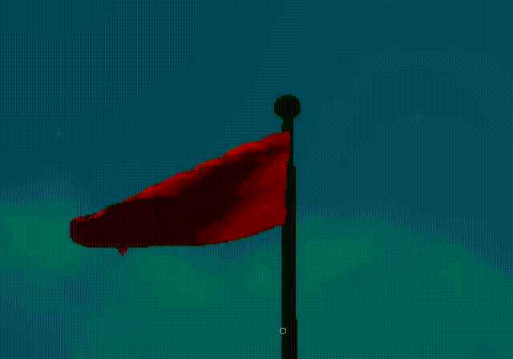
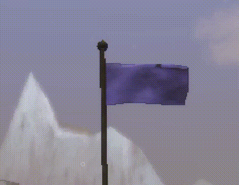
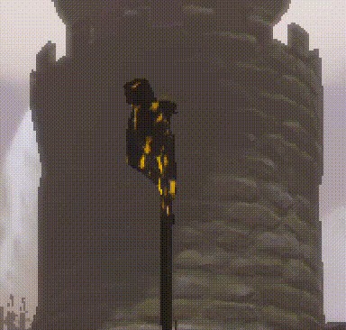
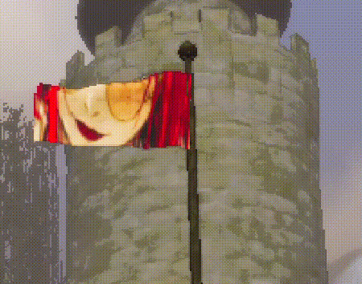

# ArtFlagControl

**ArtFlagControl** is a lightweight client-side visual mod for **Mage Arena** that allows you to control how you see the flag. 
After all, sometimes some players might draw indecent things on the team flag, but maybe you just want a personalized flag.

The mod replaces the default flag materials at runtime, giving each faction a distinct visual identity while avoiding
common HDRP issues such as excessive shine, flickering, or neon colors.

## 📸 Screenshots

|                  Solid Color                   |                   Sorcerers URL                   |                    Warlocks                     | Local Flag                                    |
|:----------------------------------------------:|:-------------------------------------------------:|:-----------------------------------------------:|-----------------------------------------------|
|  |  |  |  |

## ✨ Features

* 🎨 Customizable flag colors per faction
* 🖼️ **New:** Custom local textures and remote image URLs support
* 🧙 Designed specifically for **Mage Arena**
* 🏳️ Supports:

    * Neutral
    * Sorcerers
    * Warlocks
* 🌑 Dark-fantasy friendly color presets
* 🚫 No shimmer / flickering on moving flags
* 🧵 Cloth-like, matte appearance (no plastic look)
* ⚙️ Simple `.cfg` configuration
* 🔧 Built with **BepInEx + Harmony**

## 🖼 Visual Philosophy

Mage Arena has:

* dark environments
* strong HDR lighting
* heavy contrast and shadows

Because of that, **pure white, pure black, or highly saturated colors look bad in HDRP**.

ArtFlagControl uses:

* muted colors
* low smoothness
* no emission
* no GPU instancing on flag materials

This results in flags that:

* remain readable at a distance
* it feels like fabric
* blend naturally into the world

## 📦 Installation

1. Install **BepInEx 5** for Mage Arena
2. Download the latest release of **ArtFlagControl**
3. Extract the DLL into:

  ```
  MageArena/BepInEx/plugins/
  ```

4. Launch the game once to generate the config file
5. Edit the config if desired
6. Restart the game

## ⚙️ Configuration

The config file is generated at:

```
BepInEx/config/com.harukadev.magearena.artflagcontrol.cfg
```

### Default configuration

```ini
## Settings file was created by plugin ArtFlagControlMod v1.0.0
## Plugin GUID: com.harukadev.magearena.artflagcontrol

[Colors]

## Hexadecimal color code for the Neutral faction. This color is applied only if both ImagePath and ImageUrl are empty. Example: #FFFFFF for white.
# Setting type: String
# Default value: #D6D6D6
NeutralHexColor = #D6D6D6

## Hexadecimal color code for the Sorcerer faction. This color is applied only if both ImagePath and ImageUrl are empty.
# Setting type: String
# Default value: #4B4A6A
SorcererHexColor = #4B4A6A

## Hexadecimal color code for the Warlock faction. This color is applied only if both ImagePath and ImageUrl are empty.
# Setting type: String
# Default value: #2A1E28
WarlockHexColor = #2A1E28

[DynamicTextures]

## Direct web URL to an image for the Neutral faction. This setting has the highest priority over local paths and hex colors.
# Setting type: String
# Default value: 
NeutralImageUrl =

## Direct web URL to an image for the Sorcerer faction.
# Setting type: String
# Default value: https://www.harukadev.com/img/public/sorceres_banner.jpg
SorcererImageUrl = https://www.harukadev.com/img/public/sorceres_banner.jpg

## Direct web URL to an image for the Warlock faction.
# Setting type: String
# Default value: https://www.harukadev.com/img/public/warlocks_banner.jpg
WarlockImageUrl = https://www.harukadev.com/img/public/warlocks_banner.jpg

[General]

## Toggle the ArtFlagControl mod. When disabled, flag appearances will revert to game defaults upon match restart.
# Setting type: Boolean
# Default value: true
Enabled = true

## Enable local caching for textures downloaded via URL. This reduces bandwidth usage and prevents rate limiting from external image hosts.
# Setting type: Boolean
# Default value: true
UseCache = true

## Enable verbose logging in the console. Useful for troubleshooting texture application issues and identifying internal object names.
# Setting type: Boolean
# Default value: false
DebugMode = false

[Textures]

## The local file path to a custom image (.png or .jpg) for the Neutral faction. Priority order: ImageUrl > ImagePath > HexColor.
# Setting type: String
# Default value: 
NeutralImagePath =

## The local file path to a custom image (.png or .jpg) for the Sorcerer faction.
# Setting type: String
# Default value: 
SorcererImagePath =

## The local file path to a custom image (.png or .jpg) for the Warlock faction.
# Setting type: String
# Default value: 
WarlockImagePath =
```

### Notes

* Priority order for appearance: **ImageUrl** (highest) > **ImagePath** > **HexColor** (lowest).
* Colors must be valid **HEX color strings**.
* Local paths must be absolute paths to `.png` or `.jpg` files.

## 🧠 Technical Overview

* Hooks into Mage Arena using **Harmony**
* Runs after the main menu initializes
* Locates all `FlagController` instances
* Clones the original flag material
* Applies:

    * Custom base color
    * Metallic = 0
    * Low smoothness
    * Disabled emission
    * Disabled GPU instancing
    * Disabled a normal map (to prevent shimmer)
* Applies materials using `.material` to allow **per-flag customization**

## 🔌 Compatibility

* ✅ Mage Arena (Unity 2023 / HDRP)
* ✅ BepInEx 5.x
* ❌ Incompatible with:

    * `com.magearena.hostsettings` (explicitly blocked)

## 🛠 Development

* Language: **C#**
* Frameworks:

    * BepInEx
    * Harmony
* Rendering Pipeline:

    * HDRP

### Plugin ID

```
com.harukadev.magearena.artflagcontrol
```

## 📜 License

[MIT License](./LICENSE)
